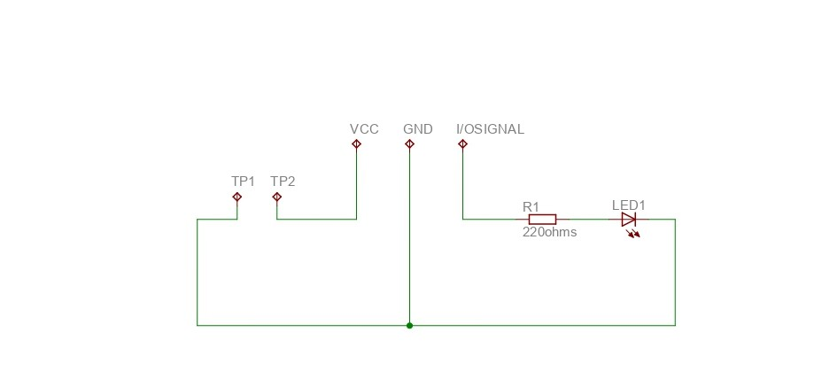
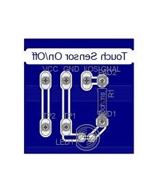
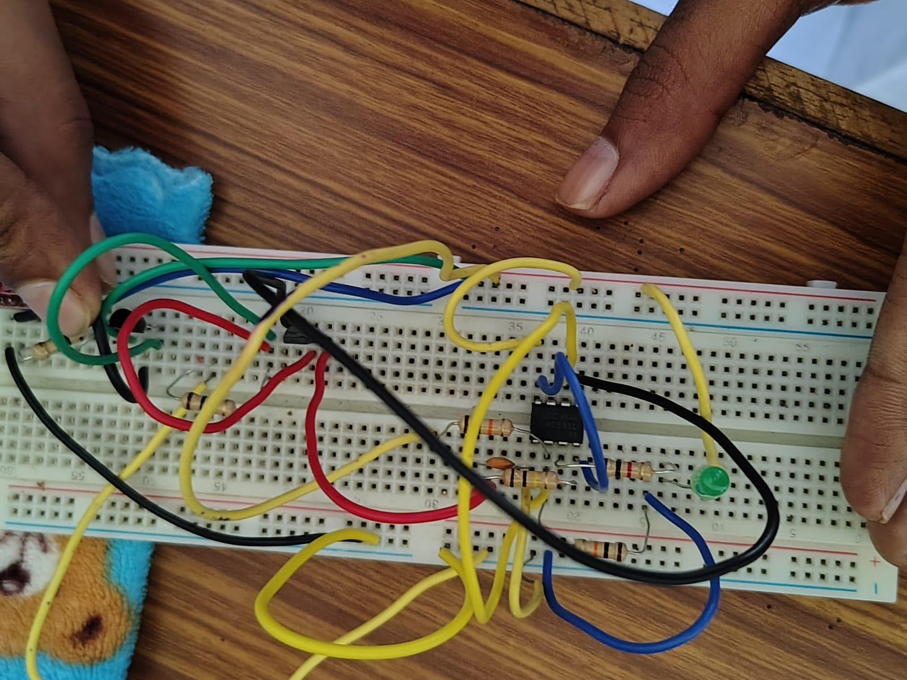
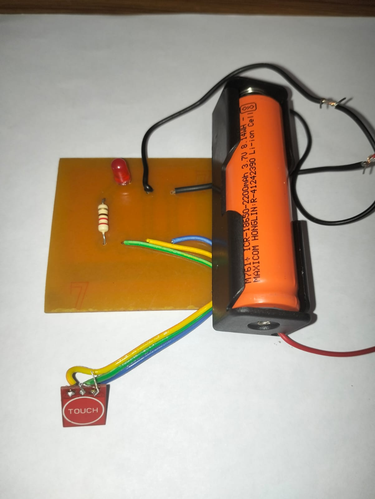
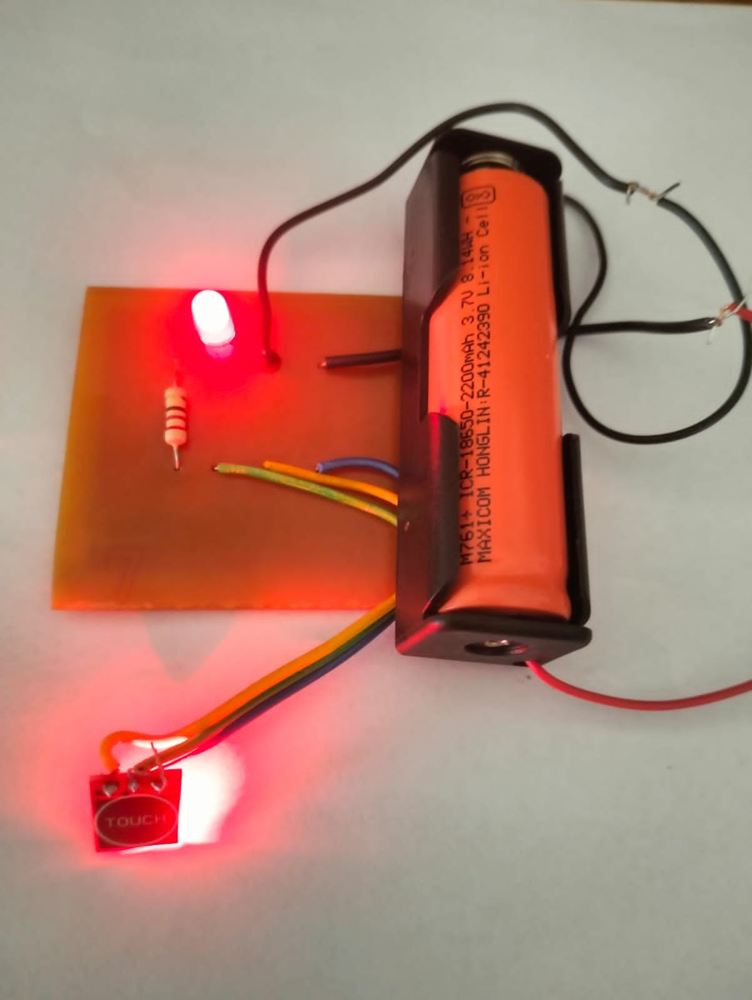

# Touch-Based ON/OFF Switch 🔴

A Touch-Based ON/OFF Switch PCB Project Using a TTP223 Touch Sensor Module.

## 📌 About the Project

This project demonstrates a simple touch-based switching system using a TTP223 touch sensor module. A touch input is used to control an LED, providing a simple and convenient ON/OFF control method.

## 🛠️ Components Used

- TTP223 Touch Sensor Module
- LED
- 220Ω Resistor
- 3.7V Rechargeable Battery
- PCB
- Connecting Wires

## ⚙️ Working Principle

The TTP223 touch sensor detects a touch input and produces a corresponding output signal. This signal controls the LED through the connected circuit.

When the touch input is activated, the LED turns ON. When the touch state is changed, the LED turns OFF.

## 🔌 Circuit Diagram

## 🟦 PCB Layout

## 🔧 Prototype Setup

The circuit was initially tested using a breadboard before implementing the final hardware setup.

## 💡 Hardware Output

### LED OFF

### LED ON

## ✨ Applications

- Touch-controlled lighting
- Electronic switching systems
- User-friendly control interfaces
- Simple automation projects

## 📚 Learning Outcomes

Through this project, I gained practical experience in:

- Basic circuit design
- PCB development
- Touch sensor interfacing
- Electronic component connections
- Hardware testing and implementation

## 🚀 Future Scope

The project can be further developed by controlling larger loads, adding wireless connectivity, or integrating it with smart-home and IoT systems.

---

**ECE Project | Learning • Building • Improving 🚀**
